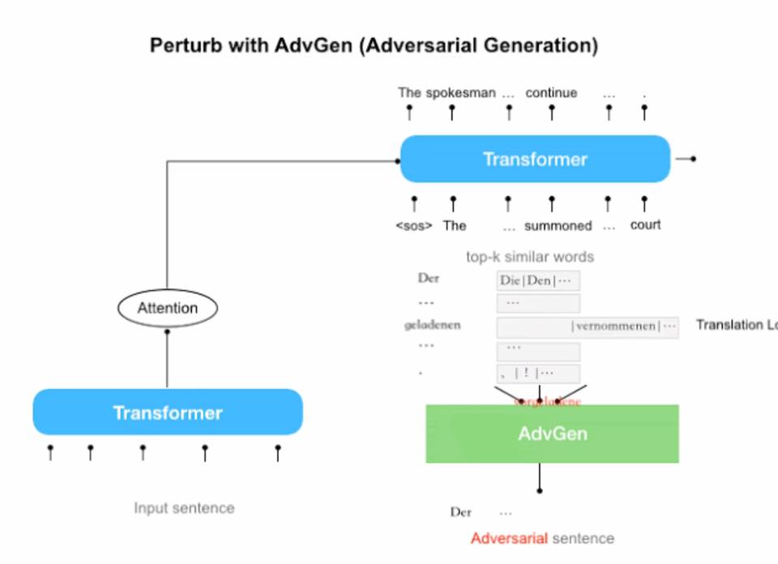
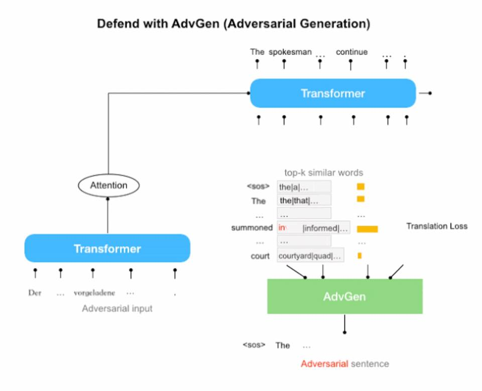
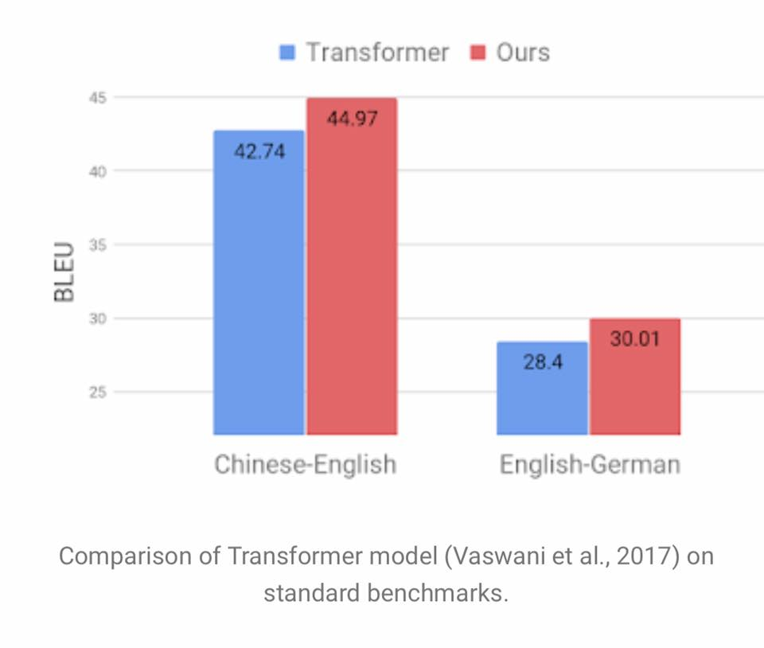
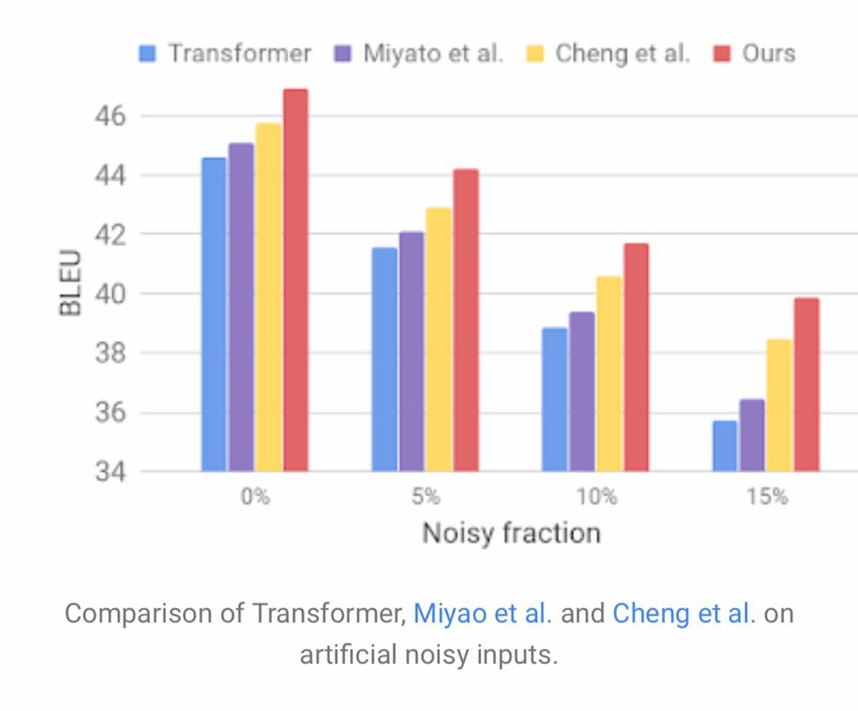

# Robust Neural Machine Translation with Doubly Adversarial Inputs

Our #ACL2019 Review 4 from Association of Computational Linguistics (ACL) holding in Florence, Italy is #AdvGen from @GoogleAI to reduce mistranslation rates by using generated adversarial examples to improve the stability of machine translation models against small perturbations in the input.

Improves NMT performance above benchmarks.

Read at https://arxiv.org/pdf/1906.02443.pdf

Kudos to Lu Jiang Wolfgang Macherey
